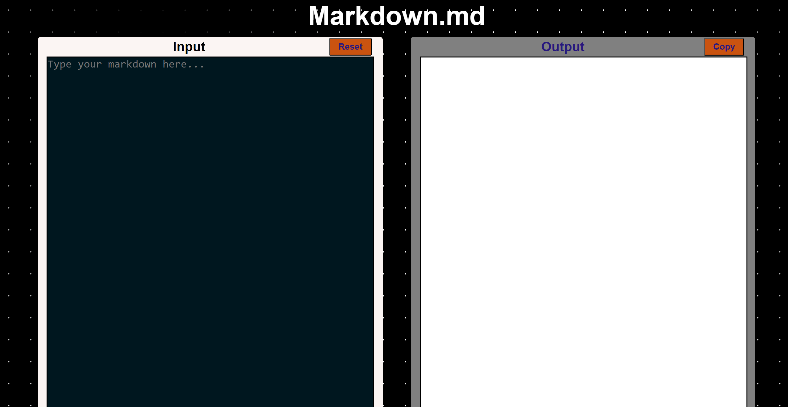

# Masterji-Assignment-5

## Markdown.md
This is a a simple readme markdown previewer that allows users to enter markdown text in a textarea and display the formatted preview in real time


## Tech Stack

- HTML
- CSS
- JavaScript

## External Scripts Used

```
    <script src="https://cdnjs.cloudflare.com/ajax/libs/highlight.js/11.5.1/highlight.min.js"></script>
    <script src="https://cdn.jsdelivr.net/npm/marked/marked.min.js"></script>
```

## Features Implemented

1. Real-time Markdown Preview
   - Instant conversion of markdown to HTML
   - Live preview updates as you type

```
   function markdowntext() {
  const output = document.getElementById("outputtext");
  output.classList.add("loading");

  try {
    const inputtext = input.value;
    // Use setTimeout to prevent UI blocking during parsing
    setTimeout(() => {
      output.innerHTML = marked.parse(inputtext);
      output.classList.remove("loading");
    }, 0);
  } catch (error) {
    showToast("Error parsing markdown");
    output.classList.remove("loading");
  }
}
```
2. Syntax Highlighting
   - Support for code blocks
   - Multiple programming language highlighting

```
marked.setOptions({
  breaks: true, // Convert line breaks to <br>
  gfm: true, // Enable GitHub Flavored Markdown
  highlight: function (code, language) {
    // Syntax highlighting for code blocks
    if (language && hljs.getLanguage(language)) {
      try {
        return hljs.highlight(code, { language: language }).value;
      } catch (err) {
        console.error(err);
        return code;
      }
    }
    return hljs.highlightAuto(code).value;
  },
});

// Initialize highlight.js
hljs.highlightAll();
```
3. Basic Markdown Support
   - Headers
   - Lists (ordered and unordered)
   - Links and Images
   - Code blocks
   - Bold and Italic text

## How to Use

1. Clone the repository
2. Open index.html in your browser
3. Start typing markdown in the left panel
4. See the formatted preview in the right panel


### Live Preview : https://markdownmd.netlify.app/